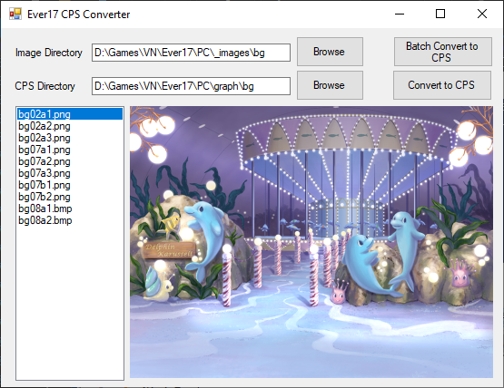

# Ever17 Image Converter
Convert standard image formats (PNG, BMP) to PRT, then compress it into a CPS file. For the PC version of  [Ever17: The Out of Infinity](https://vndb.org/v17).

Precompiled binaries can be found in [Releases](https://github.com/arsym-dev/Ever17-CPS-Converter/releases).

## Usage
1. Set "Image Directory" to the folder that has all your images in standard format
2. Set "CPS Directory" to where you'd like to export the final CPS files
    - In order to avoid recompiling the DAT files (eg. `bg.dat`), you can create a subdirectory in the "graph" folder with the appropriate name. (eg. `<Ever17>/graph/bg`). Any file placed in here will take priority over the DAT archive.
3. You can either convert one image at a time by selecting the image and pressing "Convert to CPS", or convert all at once with "Batch Convert to CPS".

